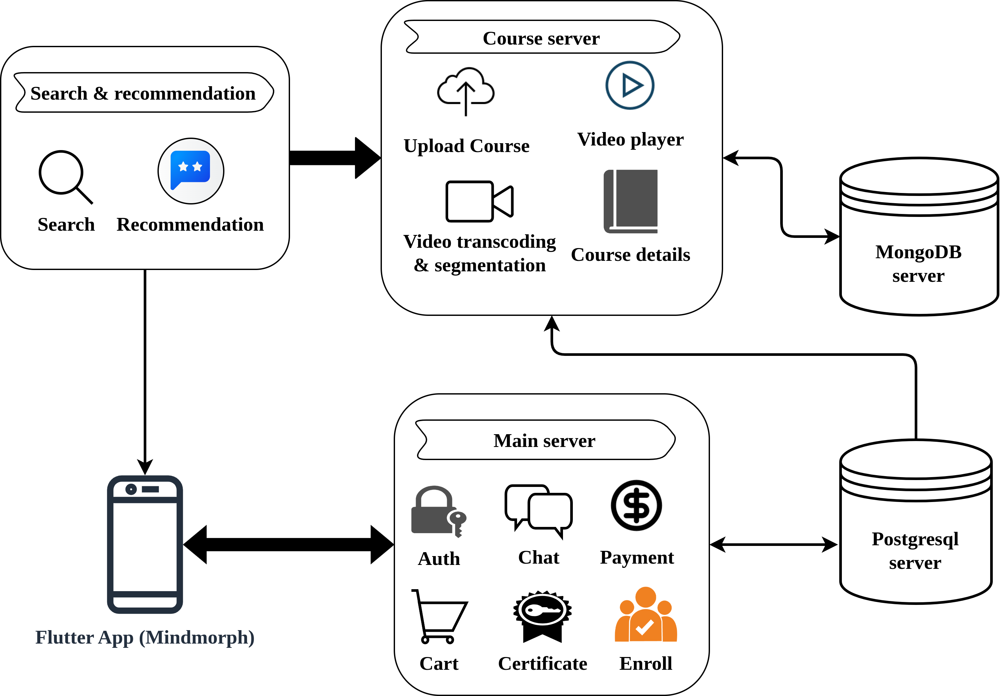
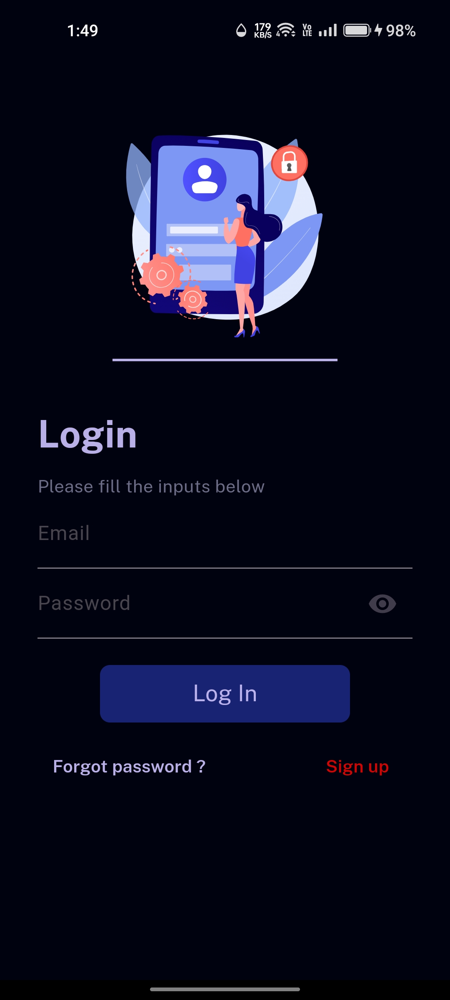
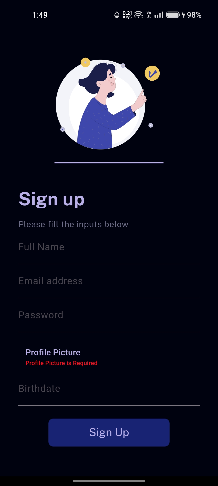
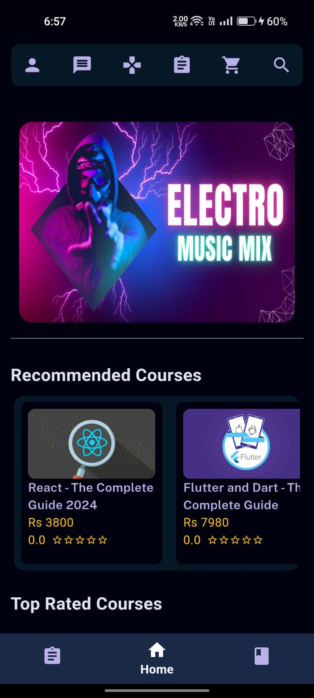
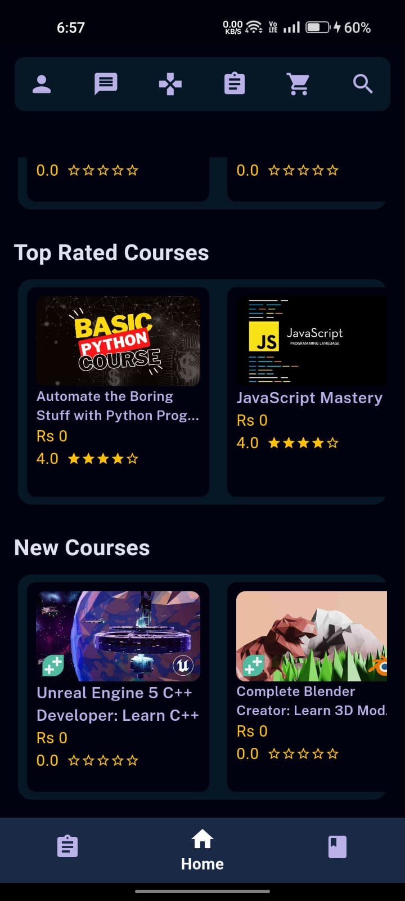
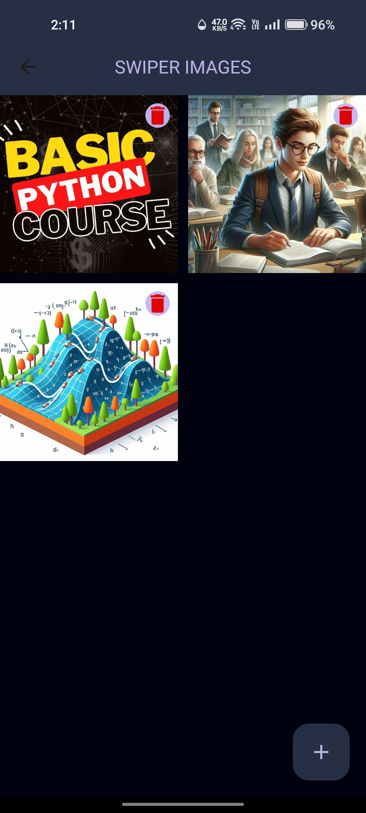
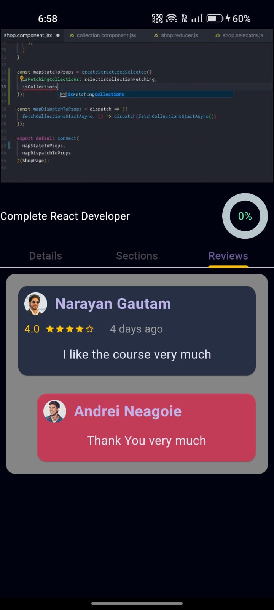
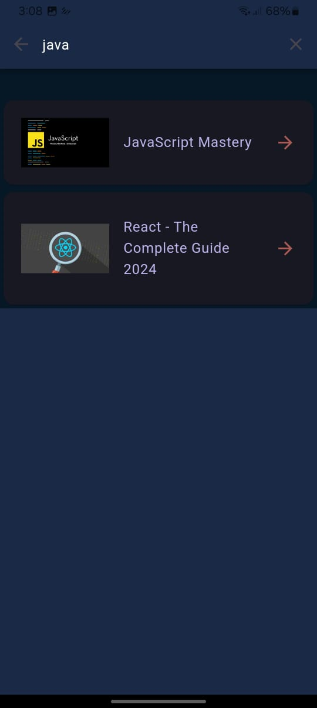

# MindMorphFrontend

Frontend Repository of MOOC platform using flutter and dart

**MindMorph** provides a similar service to such as Udemy, which can stream high-definition video content to users on a variety of devices, including smartphones, tablets, and smart TVs. The platform uses adaptive bitrate streaming technology to ensure smooth playback and optimal quality, based on the user's device and network conditions.

## To Run Project

### Run Backend

1. Install Nodejs
2. [Clone Backend](https://github.com/gnarayyan/MindMorph)
3. Navigate to Project directory and install dependencies

   ```shell
   cd backend
   npm i
   ```

### Run MobileApp

1. Install Flutter in your device
2. Clone this repository
3. Navigate to Project directory and install dependencies
   `flutter pub get`
4. `flutter run`

### System Architecture



## Screenshots

### Auth Screen

| Login Page                             | Signup Page                             |     |
| -------------------------------------- | --------------------------------------- | --- |
|  |  |     |

### Home Screen

| Home Page                        | Home Page                         |
| -------------------------------- | --------------------------------- |
|  |  |

### User Profile

| Student Profile                                           | Instructor Profile                                           |
| --------------------------------------------------------- | ------------------------------------------------------------ |
|  |  |

### Admin Features

| Swiper Images                            | Gamification Data                                     |
| ---------------------------------------- | ----------------------------------------------------- |
|  |  |

### Student Features

1. Play Enrolled Course
   | Course Details | Play Course |Course Review |
   |---|---|---|
   |  |  ||

2. Browse Course
   | Search Course | Completed Course | Purchased Course |
   |---|---|---|
   |  | ! ||

### Instructor Features

1. Course
   | View All | Create New | Add Deatils |Add Section |
   |---|---|---|---|
   |||||

2. Assignments
   | View All | Create | Update |View One|
   |---|---|---|---|
   | |  |  ||
